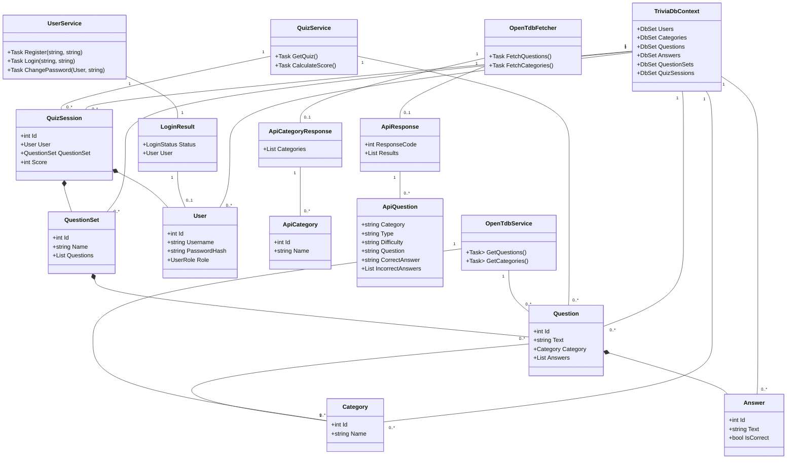
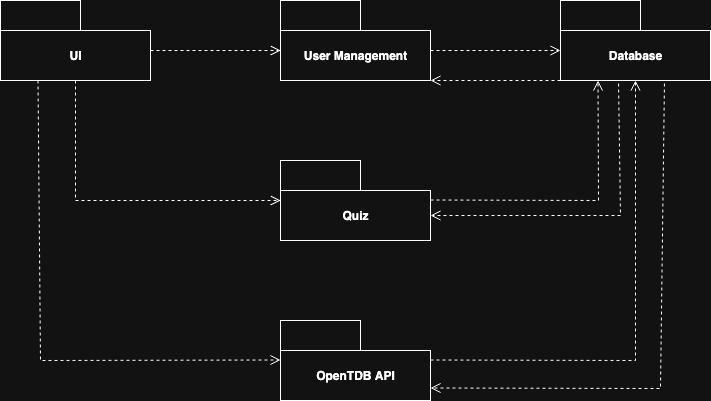

# TriviaSharp
Trivia app that fetches questions from [OpenTDB](https://opentdb.com/). This project is a university assignment for the course "Taller de Programación" at UTN FRCU.

## Diagrams
### Class Diagram

### Package Diagram

## Features 
- Fetch questions from OpenTDB
- User registration and login
- Quiz sessions with scoring
- Secure password management
- Multiple question sets and categories
- Event and error logging

## Technologies
- .NET 9.0
- Entity Framework Core 9.0.7
- .NET MAUI 9.0.51
- SQLite 9.0.7
- Serilog 4.3.0
- BCrypt 4.0.3
- XUnit 2.9.3
- OpenTDB API

# Usage
## Login
1. Navigate to "Login" page.
2. Enter your username and password.
3. Click the "Login" button.

The default credentials are:
- Username: `admin`
- Password: `triviasharp`

This user has admin privileges. You can change the password or create additional users with the registration feature.

## Registration
1. Navigate to "Register" page.
2. Enter a username and password.
3. If you are logged in as an admin, you can register the new user with admin role.
4. Click the "Register" button.

## Quiz
1. Login as a user (admin or regular user).
2. Navigate to "New Quiz" page.
3. Setup Category, Difficulty, and Question Count.
4. Click the "Start Quiz" button.
5. Read the question and click the answer you think is correct.
6. After answering all questions, you will see your score.

## Rankings
1. Navigate to "Rankings" page.
2. You will see the top 20 users with the highest scores.

## Change Password
1. Login as a user (admin or regular user).
2. Navigate to "Settings" page.
3. Navigate to "Change Password" section.
4. Enter your current password, new password, and confirm the new password.
5. Click the "Change Password" button.

## Import Questions from OpenTDB
1. Login as an admin user.
2. Navigate to "Settings" page.
3. Navigate to "Import OpenTDB Questions" section.
4. Click "Get Session Token" (A session token is used to avoid importing the same questions multiple times).
5. Click "Get Categories" to fetch available categories.
6. Select category, type, difficulty, and question count.
7. Click "Get Questions" to fetch and save questions from OpenTDB.

## Delete User
1. Login as an admin user.
2. Navigate to "Settings" page.
3. Navigate to "Delete User" section.
4. Enter the username of the user you want to delete.
5. Click the "Delete User" button.
6. Confirm the deletion in the dialog that appears.
